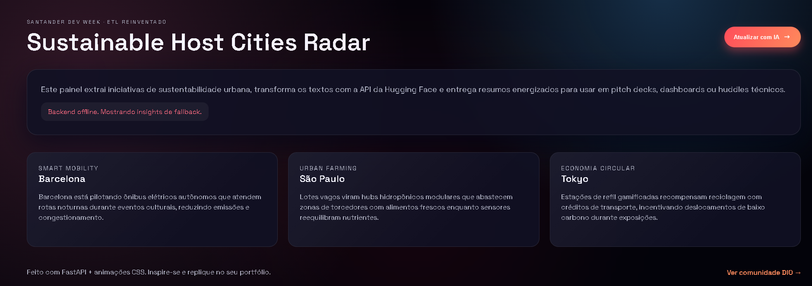
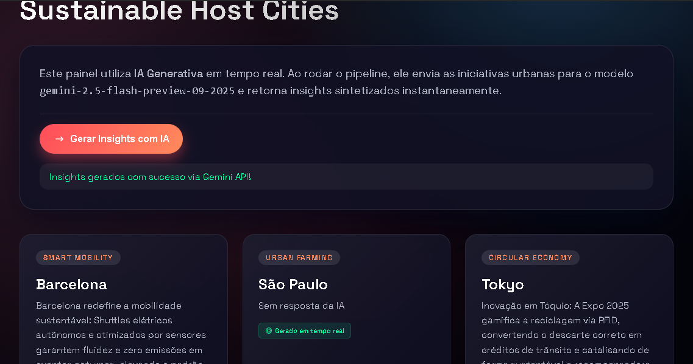

# City Sustainability Insights

**Deploy (Gemini API key): https://gemini.google.com/share/c45133122a90**

Pipeline completo inspirado no desafio Santander Dev Week / DIO: extraímos iniciativas reais de sustentabilidade urbana, transformamos o texto com IA (Hugging Face + fallback heurístico) e servimos insights prontos para pitch decks em um dashboard animado. O deploy acima mostra uma variação que consome uma API key do Gemini para storytelling dinâmico.

## Destaques
- ETL assíncrono (FastAPI + HTTPX) com tolerância a falhas: se a API da Hugging Face não estiver configurada, o fallback resume os dados localmente.
- Frontend single-page responsivo com animações e CTA que dispara o pipeline em `/etl/run` sem recarregar.
- Dados versionados em CSV/JSON dentro do repositório para auditoria e reprodutibilidade.
- Plano arquitetural em `docs/plan.md`, cobrindo decisões e futuros incrementos.

## Screenshots




## Arquitetura do Pipeline
1. **Extract** – CSV `data/raw_city_innovations.csv` com cidade, foco e descrição livre.
2. **Transform** – `backend/etl.py` envia cada linha para o modelo padrão `facebook/bart-large-cnn` via Hugging Face Inference API. Sem token? O pipeline gera títulos e insights a partir das primeiras sentenças (fallback offline).
3. **Load** – os objetos estruturados são salvos em `data/enriched_city_innovations.json` e servidos pelo backend.
4. **Expose** – `backend/main.py` entrega endpoints REST, healthcheck e os assets do frontend.

## Stack
- Python 3.11, FastAPI, HTTPX, Uvicorn, python-dotenv.
- Frontend vanilla (HTML/CSS/ESM) com animações em CSS puro.

## Como rodar localmente
```powershell
cd "c:\Users\josem\OneDrive\Área de Trabalho\DIO ETLp\app"
python -m venv .venv
.\.venv\Scripts\Activate.ps1
pip install -r requirements.txt
copy .env.example .env  # adicione HUGGINGFACE_API_TOKEN se for usar a API real
uvicorn backend.main:app --reload
```
Abra `http://127.0.0.1:8000` e clique em **Atualizar com IA** para executar o ETL sob demanda.

### Live Server / modo offline
Ao abrir `frontend/index.html` diretamente (ex.: Live Server), o app busca o backend em `http://127.0.0.1:8000`. Se não encontrar, exibe cards placeholders e bloqueia o botão até o backend voltar, garantindo UX previsível mesmo fora do ambiente FastAPI.

## Endpoints principais
| Método | Rota        | Descrição |
| ------ | ----------- | --------- |
| GET    | `/health`   | Status do serviço + modelo ativo |
| GET    | `/insights` | Retorna o JSON enriquecido (executa ETL automático se inexistente) |
| POST   | `/etl/run`  | Reexecuta o pipeline e devolve métricas |

## Scripts úteis
- `python -m backend.etl` – roda o pipeline uma vez e grava `data/enriched_city_innovations.json`.
- `python -c "from fastapi.testclient import TestClient; ..."` – smoke test rápido para health/insights.

## Estrutura
```
app/
├── backend/
│   ├── config.py
│   ├── etl.py
│   └── main.py
├── data/
│   ├── raw_city_innovations.csv
│   └── enriched_city_innovations.json
├── docs/plan.md
├── frontend/
│   ├── index.html
│   ├── styles.css
│   └── app.js
├── requirements.txt
├── .env.example
└── README.md
```

## Próximos passos sugeridos
1. Conectar fontes externas (Sheets, bancos) para alimentar o estágio *Extract* em tempo real.
2. Versionar execuções (timestamp + modelo) para auditoria e A/B de prompts.
3. Adicionar visualizações 3D/WebGL ou mapas com WebGPU para destacar fluxos de mobilidade.
